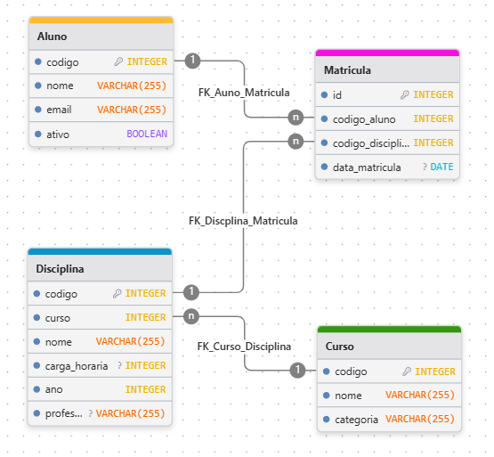

# Desafio - Vaga Programador - PUC Virtual

---

## Configuração do Ambiente de Desenvolvimento

Para este teste, você precisa fazer um clone do [projeto](https://www.github.com/) e fazer a configuração básica do app, que será descrita abaixo.

1. Faça o clone do repositório e abra um terminal no caminho da pasta raiz do projeto.
2. Para executar o projeto, será necessário que instale o python em sua máquina. É possível fazer o download do instalador clicando [aqui](https://www.python.org/ftp/python/3.12.10/python-3.12.10-amd64.exe).
3. Crie um ambiente virtual e ative ele, executando os comandos:
    `python -m venv venv`
    `.\venv\Scripts\activate`
    `pip install -r requirements.txt`
    Esses comandos, vão criar um ambiente virtual de python, ativá-lo e instalar as dependências do projeto nesse ambiente.
4. Para iniciar o servidor da API, execute o comando:
    `python manage.py runserver 8000`
    Esse comando vai executar o servidor na porta 8000, sendo possível acessá-lo em [http://127.0.0.1:8000](http://127.0.0.1:8000).

> Com o servidor configurado e rodando, você já será capaz de implementar o desafio.

---

## Execução das Tarefas
### API Django
Para ativar o ambiente virtual, execute 
    `\venv\Scripts\activate` <br>
Em seguida, inicie o servidor da API: 
    `python manage.py runserver 8000` <br>
O servidor está disponível em: (http://127.0.0.1:8000)

### Frontend
Para iniciar o projeto frontend, execute:<br>
    `cd frontend`
    `npm install`
    `npm run dev`

### Queries SQL 
As queries estão no arquivo:
    `queries/queries.sql`

> Caso queira executa-las no VS Code é necessário instalar a extensão SQLite (by alexcvzz).

### Aplicação de Console (Creche Pet)
Para iniciar a aplicação de console, execute:<br>
    `\venv\Scripts\activate` (caso o ambiente virtual não esteja em execução)<br>
    `python creche_pet.py`

---

## Desafios

### Contexto

O projeto base configurado simula um ambiente de educação, onde temos uma API para a gestão de **Alunos**, **Cursos**, **Disciplinas** e **Matrículas**. Temos essas entidades compreendidas neste pequeno diagrama.



A implementação da API, foi feita usando o [Django](https://docs.djangoproject.com/en/5.2/) com o [Django Rest Framework](https://www.django-rest-framework.org/). O funcionamento de um app Django é bem simples:

- Definimos uma **rota(url)**, que vai direcionar a requisição a um recurso da API. (urls.py)
- Esse recurso, por sua vez, é uma **view**, onde ocorre o processamento de informações e resulta no retorno da API. (views.py)
- Uma **view** pode precisar acessar os registros do banco de dados. Para isso, temos as **models**, que são a nossa representação do banco de dados. (models.py)
- Ao devolver uma resposta, a view precisa 'traduzir' a resposta para JSON. Para isso temos os **serializers**, que passam nossas models para o formato JSON. (serializers.py)

Temos dois diretórios principais:
    - 'desafio/', é a pasta do projeto django, nela temos as configurações da nossa API.
    - 'educacao/', é a pasta do nosso app, podemos ter vários apps dentro de um projeto django, cada um lidando com uma área específica do negócio. As rotas, views, models e demais classes importantes, ficam dentro do app.

### Banco de Dados

Nossa interface com o banco de dados em uma aplicativo Django, são as **models**. Uma classe no nosso arquivo *models.py* se traduz em uma tabela no banco de dados.

Por exemplo:

```python
class Aluno(models.Model):
    codigo = models.AutoField(primary_key=True)
    nome = models.CharField(max_length=255)
    email = models.CharField(max_length=255)
    ativo = models.BooleanField(default=True)
```

Essa classe, **Aluno**, representa a tabela **Aluno** no banco, com esses mesmos campos e características.
Durante o desafio, pode ser que você faça modificações nesse arquivo e, para que as alterações reflitam no banco de dados, será necessário que execute alguns comandos para que atualize o banco. Esses comandos são:
    - `python manage.py makemigrations`, esse comando vai sintetizar as alterações e preparar uma migration.
    - após a execução do comando anterior, execute `python manage.py migrate`, que vai aplicar a migration gerada anteriormente no banco de dados.

---

### Tarefa 1

Trabalhando em cima dessa API, você deverá criar uma *nova tabela* no banco de dados, que vai servir para representar, **Atividades** de uma **Disciplina**, podendo definir o nome, data e valor da atividade, assim como um identificador para cada Atividade.
Também será necessário que *crie uma tabela* que represente o desempenho de cada **Aluno** em uma **Atividade**, armazenando qual foi a atividade executada e a nota obtida pelo **Aluno**.

Depois que criar a estrutura das **Atividades**, você deve criar as rotas **CRUD**(create, read, update e delete) para gerenciar as Atividades e o desempenho dos alunos. Para que as rotas funcionem corretamente, é necessário criar as views que vão ser acessadas pelas rotas.

Para a criação das **views**, você deve utilizar a classe **APIView**.(tem exemplos de seu uso no projeto)

Finalizando a tarefa, você precisa *criar um pequeno frontend*, que deve possuir uma tela para exibir as **Disciplinas** cadastradas na API, possuir também uma tela que tenha um formulário, que vai registrar na API uma **Atividade** associada a uma **Disciplina** e, por fim, possuir uma tela onde seja possível cadastrar o *desempenho* de um **Aluno** em dada **Atividade**.

Inclua o projeto do frontend dentro de uma pasta chamada 'frontend' na estrutura desse projeto para que tenhamos apenas uma entrega.

---

### Tarefa 2

> SQL Queries

Utilizando a estrutura de banco de dados da tarefa anterior, você deve montar algumas queries para o banco em SQLite3. Essas queries devem ser colocadas em 'queries/queries.sql'.

1. Exibir o nome e o email de todos os alunos ordenados alfabeticamente.
2. Mostrar o nome e a nota de todos os alunos em uma atividade específica.
3. Listar os nomes dos cursos que possuem disciplinas cadastradas.
4. Exibir o nome dos alunos que não entregaram nenhuma atividade.
5. Exibir os nomes dos alunos que estão matriculados em disciplinas do curso de nome "Engenharia de Software".
6. Exibir os alunos que têm média de desempenho acima de 8.0 em disciplinas do curso "Matemática".
7. Listar todas as atividades realizadas no mês de maio de 2025.
8. Exibir a disciplina e a quantidade total de atividades cadastradas em cada uma.
9. Listar o nome de cada aluno e a média geral de suas notas em todas as atividades.
10. Exibir os alunos que têm pelo menos uma nota abaixo de 5.0 em qualquer atividade.

Você precisa criar **ao menos 5** queries dessas opções. A entrega consiste em deixar as queries escritas no arquivo destinado a elas.

O banco de dados já possui alguns registros.
São esses:

Curso

| codigo | nome                   | categoria       |
| ------ | ---------------------- | --------------- |
| 1      | Engenharia de Software | Tecnologia      |
| 2      | Matemática             | Ciências Exatas |
| 3      | História               | Humanas         |

---

Aluno

| codigo | nome            | email                                                         | ativo |
| ------ | --------------- | ------------------------------------------------------------- | ----- |
| 1      | Ana Clara       | [ana.clara@email.com](mailto:ana.clara@email.com)             | 1     |
| 2      | Bruno Lima      | [bruno.lima@email.com](mailto:bruno.lima@email.com)           | 1     |
| 3      | Carlos Souza    | [carlos.souza@email.com](mailto:carlos.souza@email.com)       | 1     |
| 4      | Daniela Castro  | [daniela.castro@email.com](mailto:daniela.castro@email.com)   | 1     |
| 5      | Eduardo Alves   | [eduardo.alves@email.com](mailto:eduardo.alves@email.com)     | 1     |
| 6      | Fernanda Dias   | [fernanda.dias@email.com](mailto:fernanda.dias@email.com)     | 1     |
| 7      | Gustavo Pereira | [gustavo.pereira@email.com](mailto:gustavo.pereira@email.com) | 1     |
| 8      | Helena Martins  | [helena.martins@email.com](mailto:helena.martins@email.com)   | 1     |
| 9      | Igor Almeida    | [igor.almeida@email.com](mailto:igor.almeida@email.com)       | 1     |
| 10     | Juliana Costa   | [juliana.costa@email.com](mailto:juliana.costa@email.com)     | 0     |

---

Disciplina

| codigo | curso | nome                     | carga\_horaria | ano  | professor      |
| ------ | ----- | ------------------------ | -------------- | ---- | -------------- |
| 1      | 1     | Banco de Dados           | 60             | 2025 | Prof. João     |
| 2      | 1     | Engenharia de Requisitos | 40             | 2025 | Prof. Maria    |
| 3      | 2     | Álgebra Linear           | 60             | 2025 | Prof. Júlia    |
| 4      | 2     | Cálculo I                | 60             | 2025 | Prof. Rafael   |
| 5      | 3     | História do Brasil       | 60             | 2025 | Prof. Tereza   |
| 6      | 3     | História Antiga          | 40             | 2025 | Prof. Caio     |
| 7      | 2     | Estatística              | 40             | 2025 | Prof. Daniel   |
| 8      | 1     | Testes de Software       | 30             | 2025 | Prof. Laura    |
| 9      | 1     | Arquitetura de Software  | 60             | 2025 | Prof. Vinicius |

---

Matrícula

| id | codigo\_aluno | codigo\_disciplina | data\_matricula |
| -- | ------------- | ------------------ | --------------- |
| 1  | 1             | 1                  | 2025-03-01      |
| 2  | 2             | 1                  | 2025-03-01      |
| 3  | 3             | 2                  | 2025-03-01      |
| 4  | 4             | 3                  | 2025-03-01      |
| 5  | 5             | 4                  | 2025-03-01      |
| 6  | 1             | 3                  | 2025-03-01      |
| 7  | 2             | 3                  | 2025-03-01      |
| 8  | 6             | 5                  | 2025-03-10      |
| 9  | 6             | 7                  | 2025-03-10      |
| 10 | 7             | 6                  | 2025-03-11      |
| 11 | 7             | 9                  | 2025-03-11      |
| 12 | 8             | 8                  | 2025-03-12      |
| 13 | 8             | 3                  | 2025-03-12      |
| 14 | 9             | 4                  | 2025-03-13      |
| 15 | 9             | 5                  | 2025-03-13      |
| 16 | 10            | 7                  | 2025-03-14      |
| 17 | 1             | 9                  | 2025-03-15      |
| 18 | 2             | 5                  | 2025-03-15      |
| 19 | 3             | 6                  | 2025-03-15      |
| 20 | 4             | 8                  | 2025-03-15      |

---

### Tarefa 3

Como última tarefa, você deverá fazer uma pequena aplicação de console, que vai simular uma creche para pets. Nesse programa, você irá precisar implementar um menu, com algumas opções:
    - Cadastrar Cachorro. Essa opção levará para uma série de imputs onde você irá coletar as informações do cachorro a ser cadastrado.
    - Editar Cachorro. Nessa opção deve ser possível visualizar as informações do cachorro e editá-las.
    - Visualizar Cachorro. Nessa opção deve ser possível visualizar todas as informações do cachorro.
    - Deletar Cachorro. Ao escolher essa opção, deve ser possível deletar um registro específico de um cachorro.
    - Listar Cachorros. Escolhendo essa opção, deve ser mostrado ao usuário todos os registros armazenados.
    - Fechar. Deve encerrar o programa.

> Regras

- Todos os registros devem ser mantidos em listas(arrays, vetores).
- Os registros podem ser, tanto, dicionários ou objetos, caso queira implementar classes.
- Seu código deve estar na raiz desse projeto.
- Você deve utilizar da [TheDogAPI](https://docs.thedogapi.com/docs/intro) para coletar as raças a serem armazenadas nos registros de cada cachorro. Utilize a lib do python chamada [requests](https://requests.readthedocs.io/en/latest/). Também será necessário gerar um token seu na API [aqui](https://thedogapi.com/signup).

---

### Entrega

Você terá até 12/08 - 12:00, para nos enviar o link do repositório no github com esse projeto, faça quantos commits forem necessários, codifique de forma clara e objetiva, comente sempre que julgar necessário.

Em caso de dúvidas sobre a stack de desenvolvimento, podemos esclarecer problemas mais específicos, caso encontre erros durante o desenvolvimento, recomendamos que busque a solução na documentação da ferramenta ou em fóruns.

---


